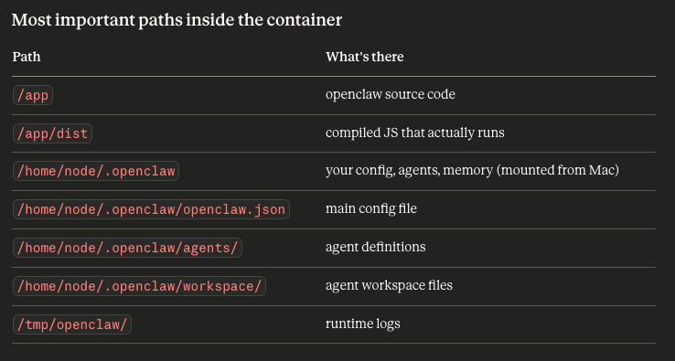

## Goal is to install openclaw insde a docker container and then push to remote VPS Hostinger

1. checkout project
2. create .env and add anthropic and related keys
3. run ./docker-setup.sh
4. once done you can run the following commands to check logs and approve devices
   - docker compose up -d openclaw-gateway
   - docker compose restart openclaw-gateway
   - docker compose run --rm openclaw-cli devices list 
   - docker compose run --rm openclaw-cli devices approve 
   REQUEST_ID_HERE
   -  docker logs -f enterprise_multi_agents_orchestrator-openclaw-gateway-1
   - docker compose build && docker compose up -d
5. For local you might have to add below in openclaw.json to avoid CORS issues. This is not recommended for production and should be used only for local testing.
```"controlUi": {
      "dangerouslyAllowHostHeaderOriginFallback": true
    }
```

start UI on 
http://127.0.0.1:18789/chat?session=main
```
IMP commands
1. docker logs -f enterprise_multi_agents_orchestrator-openclaw-gateway-1

2. docker compose run --rm openclaw-cli devices list
3. docker compose run --rm openclaw-cli devices approve REQUEST_ID_HERE


gateway commands
docker compose restart openclaw-gateway
```


### Get inside Docker Container
```
# Full interactive shell — explore everything
docker exec -it enterprise_multi_agents_orchestrator-openclaw-gateway-1 bash

# If bash doesn't work (minimal images use sh)
docker exec -it enterprise_multi_agents_orchestrator-openclaw-gateway-1 sh

```


#### health check inside container
```
- openclaw gateway status
- openclaw security audit
```
